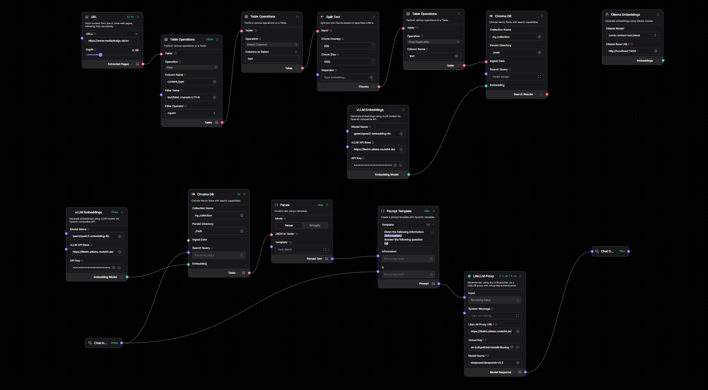

## 27 Apr 2026

What I've learned today:
Git
- My team and I initialized a Git repository for our project
- We made our first commit to ensure that everything is tracked.

Docker and Docker Compose
- I have created a Dockerfile for my Flask application and a docker-compose.yml file to set up both the Flask app and Redis services.
- I have learned how to use Redis for my Flask application.
- I have found out how to run my application using Docker and Docker Compose, which will help in deploying it easily in different environments.

AI Agent Automation Builders
- I have explored AI agent automation builders like n8n, langflow, and LangGraph. 
- They provide an easy way to create and manage AI agents without coding, which can be useful.
- I have to investigate more about these tools and apply them to my project.

## 28 Apr 2026
What I've learned today (laboratory work): I explored more images on Docker Hub and found several useful ones.
- atlassian/confluence (https://hub.docker.com/r/atlassian/confluence): Confluence Server is where you create, organise and discuss work with your team. Capture the knowledge that's too often lost in email inboxes and shared network drives in Confluence. It might be useful for our project documentation and team collaboration.
Unfortunately, I tried to use a trail version but it did not work because it threw an error when I requested a license key.
- openrouteservice/openrouteservice (https://hub.docker.com/r/openrouteservice/openrouteservice): OpenRouteService is a routing service based on OpenStreetMap data. It provides various routing options, including car, bike, pedestrian, and wheelchair routes. This could be useful for our project if we need to implement routing features.
I'm implementing this image but it still has some errors. I will investigate more about it and try to solve the issues.

Overall, I saw the way to edit docker-compose.yml file to add new services and make them work together and I will learn more about configuration.

## 4 May 2026
What I've learned today:
- I created a FastAPI application and set up a Dockerfile and docker-compose.yml file.
- I updated main.py which has endpoints for the FastAPI application.
- I've learned how to build docker containers and run them using Docker Compose (docker-compose up --build).
- My team and I are initiating a final project on github.

## 5 May 2026
What I've learned today:
- I've learned about Personas, Scenarios, User Stories, and Features identification in software development.
- I've created personas for our project, which help us understand our users better.
- I've created scenarios that describe how our users will interact with our application. We shared these scenarios with another team to get feedback and improve them.
- I've got ideas from other teams' scenarios and personas, which helped me improve our work.

## 12 May 2026
What I've learned today:
- I have learned about langflow and explored its features and capabilities.
- I have learned about RAG and implemented it by using Langflow.
- I have created two projects in Langflow, one for RAG and another for a chatbot assistant. 
- Chatbot assistant is focusing on MDH. I faced some issues about "ContextWindowExceededError" but I will change some parameters of URL to solve it.

# 18 May 2026
What I've learned today:
- I learned about the way to attach workflows in the project once created and no need to create everytime.
- We focused on the indexing today and we used many kinds of components like "Text Splitter", "Table Operations", "Prompt Template", and "LLM".
- I continued to work on RAG and chatbot assistant projects in Langflow with MDH data for example.
- I created and run my first RAG project and it worked well. I will continue to improve it and make it more efficient.

# 19 May 2026
What I've learned today:
- I continued to work on RAG and Agent projects in Langflow.
- I have learned about Web Search.
- I implemented chatbot in my project with a simple prompt template.
- I've continued to work on backend development and connected the map.

# 26 May 2026
What I've learned today:
- My team and I demonstrated our project to the professor and received feedback.
- We discussed the feedback and planned the next steps for our project development.
- We will continue to work on improving our project and prepare for midterm presentation.

